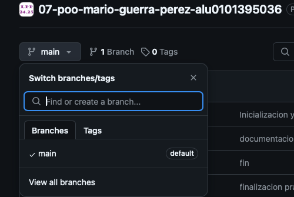
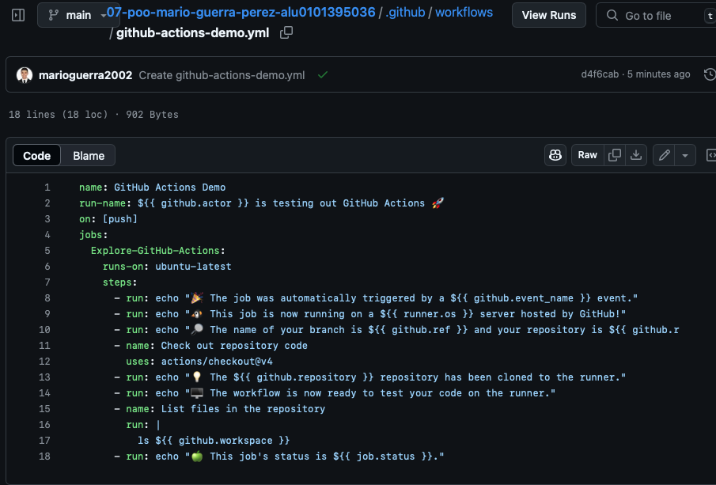
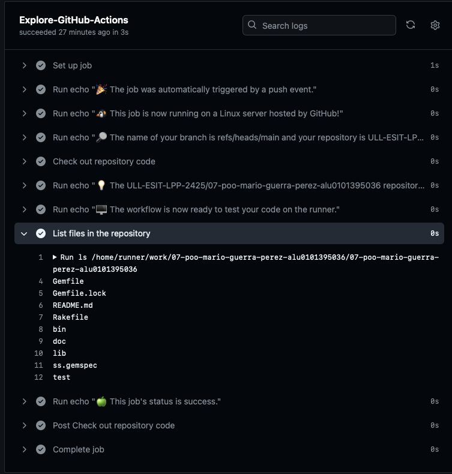

[](https://classroom.github.com/a/h8fF_2CY)
[](https://classroom.github.com/open-in-codespaces?assignment_repo_id=17874066)

---

# Práctica 1 - Configuración de máquina virtual en el IaaS

## Trabajo previo (Cursos de GitHub Skills)

### Introduction to GitHub

Se ha realizado el curso de instroducción a GitHub, en el cual se ha msotrado sobretodo a crear ramas de versiones.

  </img>

Seguidamente se ha seguido el tutorial de GitHub Actions. Se ha creado un archivo `workflow` en el cual se ha añadido una serie de tareas.

  </img>

A continuación se observa el resultado del workflow, el que se pueden ver los diferentes trabajos que se han realizado. Por ejemplo, se ha realizado un listado de los archivos que están en el directorio.

  </img>

### Communication using Markdown


Primero se debe de acceder al _IAAS_  e introducir las credenciales ULL.
Encender la máquina virtual y abrir la propia consola una vez esté encendida.

## Inicialización de la máquina virtual

Se debe de iniciar sesión con el usuario ` usuario ` y con la contraseña ` usuario `.
Luego de esto se debe introduce la nueva contraseña para iniciar sesión en la máquina virtual.

Seguidamente se instalan los controladores web con
```
sudo apt install net-tools
```
Seguidamente se comprueba la IP con

```
ifconfig -a
```

Se introduce `yes` a la pregunta que se muestra a continuación.

### Personalización de la máquina virtual
 - Cambiar el nombre de la máquina
    ```
    cat /ect/home
    sudo vi /etc/hostname
    cat /etc/hostame
    ```
    > en el fichero que se abre se cambia el nombre que por defecto está "usuario"
- Cambiar el nombre del host
    ```
    cat /etc/host
    sudo vi /etc/hosts
    cat /etc/hosts
    ```
    > en el fichero que se abre se cambia el nombre por defecto que es "ubuntu"

Una vez hecho esto, se reinicia y se acutaliza el sistema con
```
sudo reboot
sudo apt update
sudo apt upgrade
sudo reboot
```


