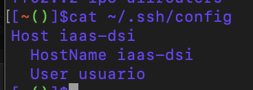
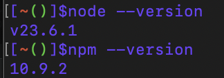

# Práctica 1 - Configuración de máquina virtual en el IaaS

## Trabajo previo (Cursos de GitHub Skills)

### Introduction to GitHub

Se ha realizado el curso de instroducción a GitHub, en el cual se ha msotrado sobretodo a crear ramas de versiones.


Seguidamente se ha seguido el tutorial de GitHub Actions. Se ha creado un archivo `workflow` en el cual se ha añadido una serie de tareas.


A continuación se observa el resultado del workflow, el que se pueden ver los diferentes trabajos que se han realizado. Por ejemplo, se ha realizado un listado de los archivos que están en el directorio.


### Communication using Markdown

En este curso se ha aprendido a utilizar Markdown, un lenguaje de marcado utilizado para la creación de documentos. 

Se trabaja con el directorio ofrecido por el curso.

El objetivo es crear un documento en el que se muestre la información de los diferentes archivos que se encuentran en el directorio.

Al final se usan comentarios para añadir "tips" para los demás usuarios (es el mismo archivo que se ha creado anteriormente pero con comentarios).

### GitHub Pages

En este curso se ha aprendido a utilizar GitHub Pages, una herramienta que permite la creación de sitios web.
Se configura el directorio de GitHub para que se muestre en una página web.


Primero se debe de acceder al _IAAS_  e introducir las credenciales ULL.
Encender la máquina virtual y abrir la propia consola una vez esté encendida.

## Inicialización de la máquina virtual

Se debe de iniciar sesión con el usuario ` usuario ` y con la contraseña ` usuario `.
Luego de esto se debe introduce la nueva contraseña para iniciar sesión en la máquina virtual.

Seguidamente se instalan los controladores web con
```
sudo apt install net-tools
```
Seguidamente se comprueba la IP con

```
ifconfig -a
```

Se introduce `yes` a la pregunta que se muestra a continuación.

### Personalización de la máquina virtual
 - Cambiar el nombre de la máquina
    ```
    cat /ect/home
    sudo vi /etc/hostname
    cat /etc/hostame
    ```
    > en el fichero que se abre se cambia el nombre que por defecto está "usuario"
- Cambiar el nombre del host
    ```
    cat /etc/host
    sudo vi /etc/hosts
    cat /etc/hosts
    ```
    > en el fichero que se abre se cambia el nombre por defecto que es "ubuntu"

Una vez hecho esto, se reinicia y se acutaliza el sistema con
```
sudo reboot
sudo apt update
sudo apt upgrade
sudo reboot
```
### Adición de la máquina virtual a local

Esto se realiza para no tener la necesidad de aprenderse la IP de la máquina virtual.
````
sudo vi /etc/hosts
cat /etc/hosts
````  
Al final lo que se pretende es añadir la IP de la máquina virtual y el nombre que se le ha dado a la máquina virtual.


### Configuración de la infraestructura de clave pública-privada

El objeitvo es poder acceder a la máquina virtual sin tener que introducir la contraseña.

Ya la clave en mi caso está generada, por lo que se copia la clave pública en la máquina virtual.
```
cat .ssh/id_rsa.pub
ssh-copy-id usuario@iaas-dsi
```
Ahora al acceder a la máquina virtual no se pide la contraseña.

Cabe destacar que tambien se puede modificar el nombre de usuario en el fichero `sshd_config` modificando el propio fichero.


## Instalación de git y Node.js

### Configuración de git

Se debe de instalar git con
```
sudo apt install git
```
Seguidamente se configura git con
```
git config --global user.name "nombre"
git config --global user.email "correo"
```
Además se hace una configuración del prompt de git para poder ver en qué rama se está trabajando. Para ello se hace lo siguiente:
```
wget https://raw.githubusercontent.com/git/git/master/contrib/completion/git-prompt.sh
mv git-prompt.sh .git-prompt.sh
```
Y se edita el fichero `.bashrc` añadiendo las siguientes líneas al final del fichero:
```
source ~/.git-prompt.sh
PS1='\[\033]0;\u@\h:\w\007\]\[\033[0;34m\][\[\033[0;31m\]\w\[\033[0;32m\]($(git branch 2>/dev/null | sed -n "s/\* \(.*\)/\1/p"))\[\033[0;34m\]]$'
```


Ejecutamos con
```
exec bash -l
```

El siguiente paso es añadir la clave pública de la máquina virtual a GitHub. Para ello se copia la clave pública y se añade a GitHub.

Para ello en el apartado `configuración` de GitHub, se entra en `SSH and GPG keys` y se añade la clave.


Ahora podemos clonar un repositorio de GitHub a la máquina virtual.

### Instalación de Node.js

Para instalar Node.js se debe de hacer lo siguiente:
```
wget -qO- https://raw.githubusercontent.com/nvm-sh/nvm/v0.39.1/install.sh | bash
exec bash -l
````
Esto nos instala el manejador de versiones de Node.js.

Seguidamente se instala Node.js con
```
nvn install node
```
Si queremos instalar una versión específica de Node.js se hace con
```
nvm install 14.17.0
```


Por último, para cambiar la versión de Node.js se hace con
```
nvm use 14.17.0
```

